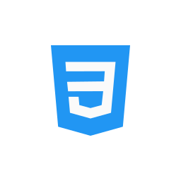

# Iftakhar Islam — Personal Portfolio
     

Professional, responsive portfolio template used to showcase a developer's work, skills, and contact details.

This project is a static HTML/CSS/JavaScript site with a contact form powered by EmailJS for client-side email delivery. Projects can be populated from a public Google Sheet.

## Demo
- Open `index.html` in your browser (recommended: serve via local HTTP server — see "Local development").

## Key Features
- Responsive layout for desktop and mobile
- Hero, About, Experience, Skills, Projects, Contact sections
- Projects can be fetched dynamically from a Google Sheet
- Contact form sends email using EmailJS (no backend required)

## Tech Stack
- HTML5, CSS3 (SASS source in `assets/scss/`), JavaScript
- Bootstrap utilities included
- Email delivery: EmailJS (client-side)

## Repository Layout
- `index.html`, `about.html`, `experience.html`, `Projects.html` — main pages
- `assets/css/` — compiled CSS and third-party styles
- `assets/scss/` — SASS source files used to build the main stylesheet
- `assets/js/` — JavaScript modules
  - `emailjs-handler.js` — EmailJS form handler and SDK loader
  - `main.js`, `script.js` — UI scripts, Google Sheets fetchers, counters, etc.
- `assets/img/`, `assets/fonts/` — media and fonts

Files of interest: [index.html](index.html), [assets/js/emailjs-handler.js](assets/js/emailjs-handler.js), [assets/js/main.js](assets/js/main.js), [assets/js/script.js](assets/js/script.js)

## Local development
It's recommended to serve the files over HTTP (some browsers restrict CDN or POST behavior on `file://`). Examples:

Node (http-server):
```bash
npx http-server -c-1 .
```

Python 3:
```bash
python -m http.server 5500
```

VS Code: Install Live Server extension and click "Go Live".

Then open http://localhost:5500 (or the port shown) and test the site.

## Configure Contact Form (EmailJS)
1. Create an account at https://www.emailjs.com/ and sign in.
2. Add/connect an email service (Gmail via OAuth or SMTP) — note the `service_xxx` ID.
3. Create an email template — note the `template_xxx` ID.
4. Copy your **Public Key** from EmailJS (Account → Integration / API keys).
5. Open `assets/js/emailjs-handler.js` and set:
   - `PUBLIC_KEY` — your EmailJS public key
   - `SERVICE_ID` — your EmailJS service ID
   - `TEMPLATE_ID` — your EmailJS template ID
6. Serve the site over HTTP and submit the contact form.

### Troubleshooting
- If the form shows `Email service unavailable.`:
  - Check DevTools Console for errors.
  - Confirm `window.emailjs` is defined in the console.
  - Confirm the SDK is loaded: the project uses `https://cdn.jsdelivr.net/npm/emailjs-com@3/dist/email.min.js`.
  - Disable ad-blockers or browser extensions that may block CDN scripts.
  - Serve the site over HTTP (not `file://`).

- If you see `405 Method Not Allowed` to `/index.html`:
  - That indicates a POST was sent to the static page (leftover fetch handler). Ensure the form has `data-emailjs="true"` and that both `main.js` and `script.js` handlers are guarded — they are by default in this repo.

## Google Sheets Projects
- Projects are fetched from a Google Sheet URL inside `assets/js/script.js` and `assets/js/main.js`. To enable dynamic projects:
  1. Create a Google Sheet and publish it or make the sheet tab public.
  2. Update the `SHEET_ID` and tab name in the JS files.

## Alternatives
- Formspree: If you prefer Formspree, remove `data-emailjs` from the form in `index.html`, set the `action` to your Formspree endpoint (e.g., `https://formspree.io/f/your-form-id`), and disable the EmailJS handler.

## Contributing & Notes
- The project is intentionally minimal and designed for easy customization. Replace images, text, and templates with your content.
- Keep secrets out of version control. EmailJS public keys are safe for client usage; do not commit private SMTP credentials.

## License
- © Md. Iftakhar Islam. All rights reserved. Replace with your preferred license if publishing.

---
## Deployment

This project can be deployed on static-hosting platforms such as Netlify, Vercel, or GitHub Pages. Below are quick setup steps.

Netlify
- Connect your Git repository in the Netlify dashboard.
- Set the build command to `npm run build:css` (optional if you commit compiled CSS) and the publish directory to the repository root (`/`).
- If you don't commit compiled assets, configure Netlify to run `npm ci` then `npm run build:css` as the build command.

Vercel
- Import the Git repository in Vercel.
- In Project Settings → Build & Output, add a Build Command: `npm run build:css` and set the Output Directory to `/`.

GitHub Pages
- Option A (with compiled assets committed): push the compiled `assets/css/main.css` to the `main` branch and enable GitHub Pages in the repository settings (source: `main` or `/docs` as preferred).
- Option B (build on CI and deploy): use GitHub Actions to compile SCSS and push the built assets to the `gh-pages` branch or use an action to publish the site.

## Continuous Integration & Build (SCSS)

This repo uses a simple Node-based build step to compile SASS/SCSS into CSS. The following files are provided to help automate builds:

- `package.json` — adds `build:css` and `watch:css` scripts using `sass` (Dart Sass).
- `.github/workflows/ci.yml` — GitHub Actions workflow that installs dependencies and runs `npm run build:css` on `push` and `pull_request`.

Local build commands

Install dependencies:
```bash
npm ci
```

Compile SCSS once:
```bash
npm run build:css
```

Watch SCSS for changes during development:
```bash
npm run watch:css
```

Notes
- The CI workflow does not commit built files back to the repository by default; it produces an artifact. If you want the compiled CSS tracked in the repo (simpler for GitHub Pages), commit `assets/css/main.css` after running `npm run build:css` locally or configure the workflow to push to the `gh-pages` branch.


